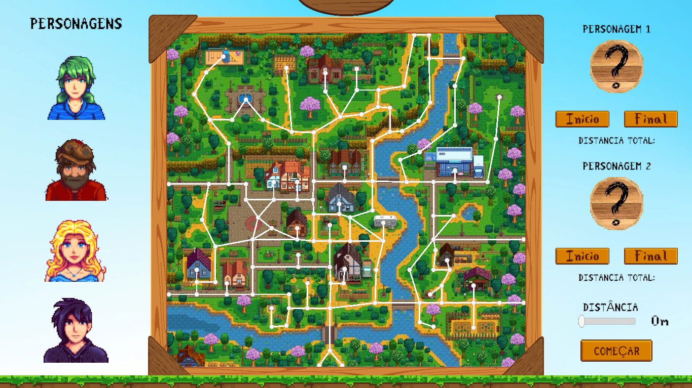
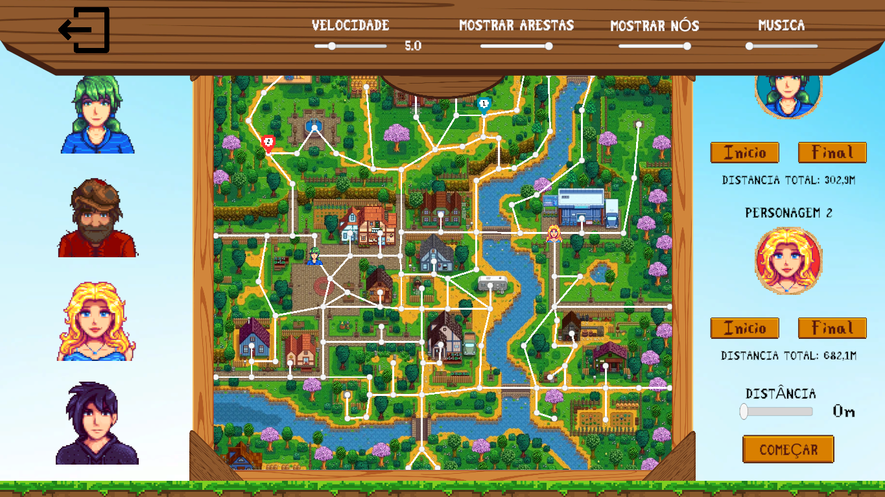
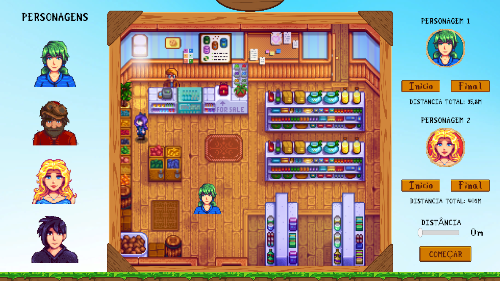
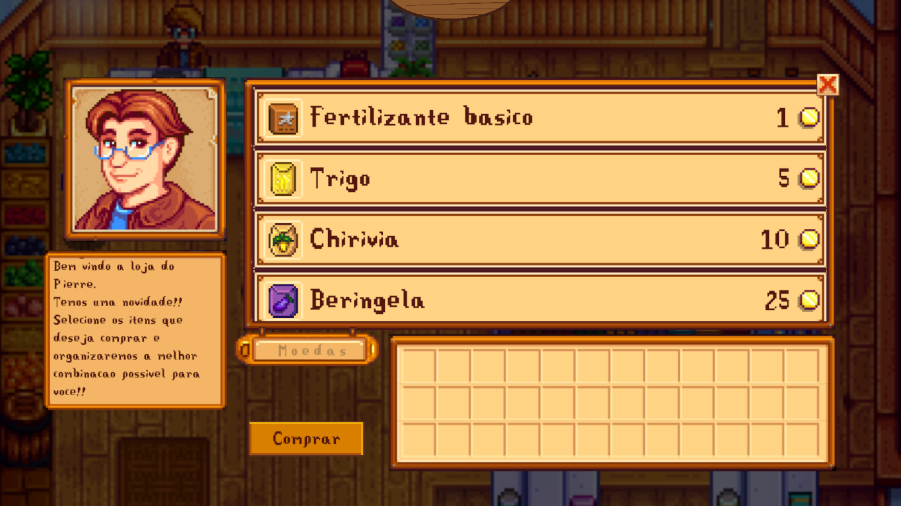
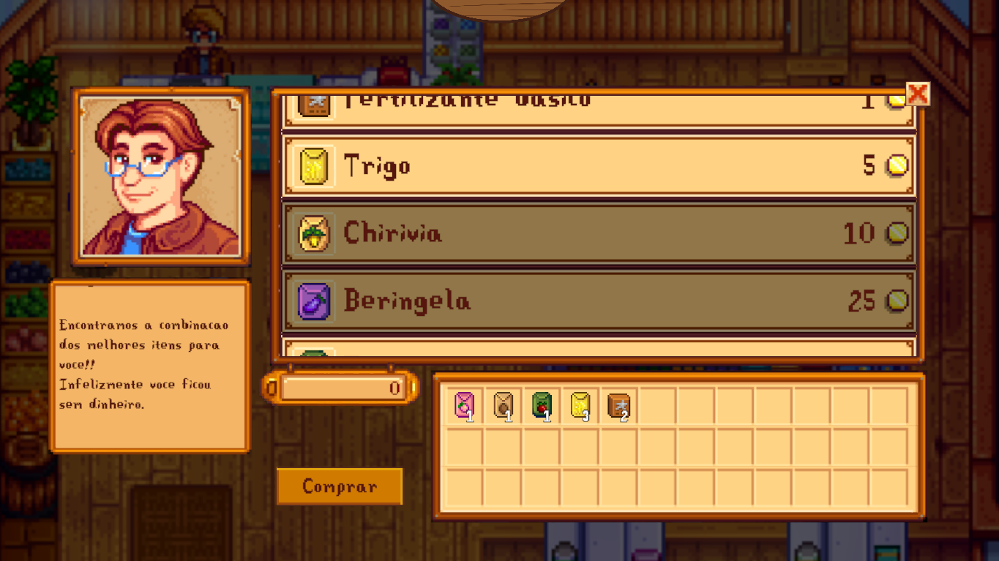

# Maps da Vila Pelicanos 

**Número da Lista**: 10 
**Conteúdo da Disciplina**: Greed 

## Alunos
|Matrícula | Aluno |
| -- | -- |
| 21/1043647  |  Giovanni Alvissus Camargo Giampauli |
| 21/1031092  |  Larissa Gomes Silva |

## Sobre 
Os habitantes da Vila Pelicanos precisam constantemente se locomover o mais rápido por ela para chegar nas lojas antes de fecharem, ou encontrar o melhor caminho para dar um presente a outro habitante. Pensando nisso, foi criado um Maps da Vila Pelicanos, para que consigam chegar o mais rápido possível pelo menor caminho ao seu destino. Os habitantes podem informar ao software quão distante querem ficar daqueles que não gostam muito, será informado a menor rota para que não se encontrem e acabe acontecendo uma briga. Nessa nova versão, a lojinha do Pierre foi adicionada e agora dispõe de uma nova forma de se fazer compras! O habitante informa quais itens tem interesse de comprar e o Pierre irá retornar a combinação dos melhores itens de acordo com quanto dinheiro você possui, infelizmente quanto melhor o produto mais caro.

Video explicando o projeto se encontra no arquivo. `Explicacao-do-projeto.mp4`.

## Screenshots
Tela inicial para seleção dos dados, em caso de dúvidas ver sessão de Uso

Tela com os dados selecionados 

Menu de configurações

Loja do Pierre

Menu de seleção dos itens

Produtos selecionados e dinheiro informado

Mochila com os produtos da combinação retornada 

## Instalação 
**Linguagem**: C# 
Pré-requisitos: 
- Primeiramente é necessário clonar ou baixar o projeto para a sua máquina
- Para rodar o projeto como exe, basta ter SO Windows ou possuir biblioteca para rodar exe no Linux.
    - O arquivo exe está localizado na pasta Vila Pelicano, o arquivo Vila Pelicano.exe
- Para rodar o código no computador, é necessário abrir o projeto no aplicativo UnityHub
    - Quando o projeto estiver aberto na Unity, basta dar play para rodar
- O arquivo contendo o algoritmo principal utilizado está em Assets/Scripts/Market.cs

## Uso 
Após baixar e iniciar o arquivo .exe, irá aparecer um menu inicial. Ao iniciar o jogo, o usuário deve selecionar um personagem no painel esquerdo, após isso informar quais os nós de inicio e fim clicando no botão início e em seguida no nó escolhido no mapa, repetir o mesmo para fim. O mesmo processo deve ser feito para selecionar o segundo personagem e seus nós respectivos. Por fim, deve ser informado a distância mínima que devem permanecer um do outro no slider de Distância, em seguida apertar o botão de começar. Há um painel de controle para regular o volume da música de fundo, além da opacidade das arestas e vértices sobre o mapa da vila e a velocidade de locomoção do aldeão escolhido.

Para comprar na lojinha do Pierre, basta clicar no campo escrito Moedas e digitar quanto dinheiro você gostaria de gastar. Em seguida, ao clicar nos itens do menu principal, você estará desselecionando ele de forma que não será considerado para a compra, é possível scrollar para baixo para ver mais itens. Por fim, basta apertar em comprar que será adicionado todos os itens que foi possível comprar aos slots da mochila e o dinheiro será atualizado para o que sobrou, em caso de sucesso será 0 e em soluçã não possível qualquer resto.

